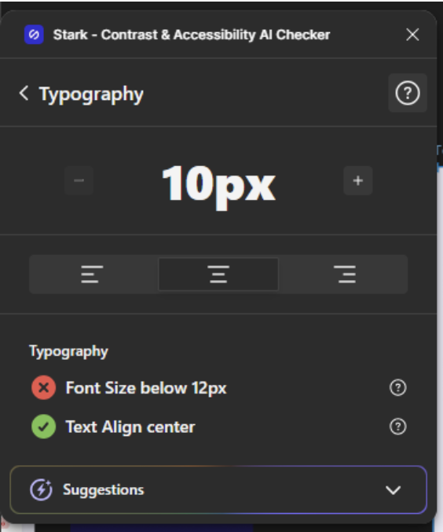

### task 1
Em guia.md, transcreva o conteúdo das personas presentes na pasta personas, para indicar
que a IA nao cole as fotos no html, mas extraia as informacoes sobre personas e cenarios daquela foto. 

### task 2
Já as fotos presentes em assets devem ser incorporadas no slide de forma organizada e coerente

### task 3
Reformule a seção da quantidade de slides e divisão de conteudo por slides adicionando agora alguns resultados da analise que finzemos
em cada perfil:

GUIA DE AVALIAÇÃO DE USABILIDADE DO PROTÓTIPO
Projeto: Sistema de Gestão Acadêmica (Perfis: Gestor, Aluno e Professor)
Avaliadores: Andrezza Abreu de Magalhães
Data: 25/06/2026
PARTE 1: PERCURSO COGNITIVO
Instruções de preenchimento: Para cada ação de cada tarefa, olhe para a tela correspondente no Figma e responda às 4 perguntas clássicas com [Sim / Não] e justifique no campo "Observações/Problemas".
Q1: O usuário vai tentar alcançar o efeito correto? (Ele sabe o que fazer?) - Modelo Mental
Q2: O usuário vai notar que a ação correta está disponível? (O botão/link está visível?) - Visibilidade
Q3: O usuário vai associar a ação correta com o efeito desejado? (O texto/ícone faz sentido?) - Affordance
Q4: Se a ação for executada, o usuário vai perceber que está progredindo? (Há feedback visual?) - Feedback
Tarefa 1: No perfil do gestor, obter dados sobre evasão
Ação 1: Logar no sistema
Q1: [x]
Q2: [x]
Q3: [x]
Q4: [x]
Observações/Problemas:
Nenhum
Ação 2: Clicar no menu hambúrguer e selecionar 'relatórios'
Q1: [x]
Q2: [x]
Q3: [x]
Q4: [x]
Observações/Problemas:
Nenhum
Ação 3: Aplicar os filtros necessários
Q1: [x]
Q2: [x]
Q3: [x]
Q4: [x]
Observações/Problemas:
Visibilidade: Aumentar contraste dos filtros de turma
Ação 4: Clicar em 'exportar'
Q1: [x]
Q2: [x]
Q3: [x]
Q4: [x]
Observações/Problemas:
Visibilidade: Adicionar um botão flutuante de “exportar” já no topo da página

Tarefa 2: No perfil do aluno, realizar check-in em uma aula
Ação 1: Logar no sistema
Q1: [x]
Q2: [x]
Q3: [x]
Q4: [x]
Observações/Problemas:
Nenhum
Ação 2: Clicar no ícone de 'presença' logo na primeira tela
Q1: [x]
Q2: [x]
Q3: [x]
Q4: [x]
Observações/Problemas:
Nenhum
Ação 3: Escolher entre as opções disponíveis
Q1: [x]
Q2: [x]
Q3: [x]
Q4: [x]
Observações/Problemas:
Nenhum
Ação 4: Digitar o código da turma e confirmar
Q1: [x]
Q2: [x]
Q3: [x]
Q4: [x]
Observações/Problemas:
Nenhum
Tarefa 3: No perfil do professor, obter dados sobre alunos em risco
Ação 1: Logar no sistema
Q1: [x]
Q2: [x]
Q3: [x]
Q4: [x]
Observações/Problemas:
Nenhum
Ação 2: Clicar no menu hambúrguer e selecionar 'alunos em risco'
Q1: [x]
Q2: [x]
Q3: [x]
Q4: [x]
Observações/Problemas:
Nenhum
Ação 3: Aplicar os filtros necessários
Q1: [x]
Q2: [x]
Q3: [x]
Q4: [x]
Observações/Problemas:
Nenhum

PARTE 2: AVALIAÇÃO HEURÍSTICA (10 HEURÍSTICAS DE NIELSEN)
Instruções de preenchimento: Navegue pelas 4 funcionalidades indicadas. Se encontrar a quebra de alguma heurística, liste o número da heurística, descreva o problema e defina a severidade (0 = Não é um problema | 1 = Cosmético | 2 = Leve | 3 = Grande | 4 = Catástrofe).
Funcionalidade 1: No perfil do gestor, exportar relatório sobre evasão
Heurística(s) violada(s): 6, 8 e 10
Descrição do problema: 6: Botão “exportar” não tão visível, 8: Há muitas informações na tela inicial, 10: não há links para a documentação de ajuda/tutorial.
Grau de Severidade (0 a 4): 1
Sugestão de melhoria: Adicionar botão “exportar” flutuante ao longo da rolagem da página, verificar quais informações tem necessidade real de aparecer no dashboard inicial ou adicionar configuração de personalização do dashboard, adicionar opção “Ajuda” no menu lateral com a documentação de uso do app.
Funcionalidade 2: No perfil do aluno, enviar uma atividade complementar - Incompleto
Heurística(s) violada(s): 3 e 10
Descrição do problema: 3: Ausência do botão de voltar ao longo da navegação, 10: não há links para a documentação de ajuda/tutorial.
Grau de Severidade (0 a 4): 2
Sugestão de melhoria: Adicionar botão de voltar para deixar a navegação mais fluida, adicionar opção “Ajuda” no menu lateral com a documentação de uso do app.
Funcionalidade 3: No perfil do professor, intervir em um aluno
Heurística(s) violada(s): Nenhuma
Descrição do problema: Nenhuma
Grau de Severidade (0 a 4): 0
Sugestão de melhoria: Página ok
Colinha rápida das 10 Heurísticas para o grupo consultar:
Visibilidade do status do sistema: O sistema mantém o usuário informado sobre o que está acontecendo?
Correspondência entre o sistema e o mundo real: A linguagem, ícones e termos são familiares para alunos/professores/gestores?
Controle e liberdade do usuário: O usuário consegue desfazer ações, voltar ou cancelar facilmente?
Consistência e padrões: Elementos iguais têm a mesma função e visual em todo o app?
Prevenção de erros: O sistema evita que o usuário erre (ex: confirmações antes de ações críticas)?
Reconhecimento em vez de memorização: As informações e ações importantes estão visíveis sem exigir que o usuário decore passos?
Flexibilidade e eficiência de uso: Existem aceleradores ou atalhos para usuários experientes?
Estética e design minimalista: As telas contêm apenas o necessário ou têm informação visual excessiva?
Ajuda aos usuários para reconhecer, diagnosticar e recuperar de erros: As mensagens de erro são claras e indicam uma solução?
Ajuda e documentação: Existe uma seção de ajuda se o usuário precisar?

Avaliação de Acessibilidade WCAG 2.1 com a ferramenta Stark para o Figma
Tela inicial do Coordenador
Contraste: Conformidade AA e AAA
Tipografia: Alerta sobre a legibilidade. Recomenda usar fonte de 12px.
Áreas de Toque: Conformidade AA e AAA
Simulador de Visão: Fontes pequenas perdem legibilidade no modo blurred

Alerta sobre tipografia

Perda de legibilidade em fontes pequenas na visão borrada

Tela de Ranking do Aluno
Contraste: Conformidade AA e AAA
Tipografia: Em conformidade.
Áreas de Toque: Conformidade AA e AAA
Simulador de Visão: Legível em todos os modos

Tela de Alunos em Risco do Professor
Contraste: Conformidade AA e AAA
Tipografia: Alerta sobre a legibilidade. Recomenda usar fonte de 12px.
Áreas de Toque: Conformidade AA e AAA
Perda de legibilidade em fontes pequenas na visão borrada

Simulador de Visão: Fontes pequenas perdem legibilidade no modo blurred.

Interprete o relatorio acima e adicione um resumo pratico no guia que ira direto pro slide.

### task 4
O primeiro slide deve conter o nome do prototipo e o nome dos integrantes.
Nome: Knowly
Integrantes: Maria luisa, Andrezza Abreu, Isaque Braga, Renilson Jose

### task 5
O texto da apresentacao esta muito vago. Adicione menos informacoes sobre as personas porque o card de cada uma delas esta muito poluido

### Task 6
Cenarios devem comecar com 'como estudante sobrecarregada, eu...' igual como esta no documento base.
alem disso, no slide de cenarios, os dois de baixo estao sendo cortados, e nao tem como rolar pra ver tudo

### obs importante: leia knowly-docs.md para obter contexto sobre o prototipo que estamos apresentando.

### task 7
Slide 7 é desnecessario. No slide 9, dizer quais heuristicas foram feridas (o nome delas); 
Entre o slide 11 e 12, insira algum informando a transicao entre o topico de avaliacao para o de decisoes de design.
Nao eh preciso ter um slide so para mostrar os assets, pode deixar eles menores e incluir no slide seguinte. No slide 14, insira o que cada cor significa
e como isso se relaciona com a ideia do sistema. Slide 16 eh desnecessario, pode remover. Inverta a ordem de topicos exibidos: as decisoes de design (assets, tipografia e cores devem vir primeiro), a analise do prototipo, depois.
As palavras estao desancentuadas, corrigir isso.

### task 8

- remover "15 slides" no slide 1
- remover 'Os cards foram reduzidos para mostrar apenas o essencial de cada perfil.' no slide 3
- colocar todos os cenarios das personas. se necessario, dividir em dois slides
- remover "Cada cenário mantém o formato do documento base para preservar a voz do usuário." no slide 4
- ao inves de "ajustes indicados", colocar "ajustes futuros" no slide 14 indicando que percebemos algumas falhas mas vamos corrigi-las
- ao inves desses cards no slide 1 "Presença e evolução, Metas e ranking, Fluxos validados, Reconhecimento" adicionar os topicos do slide (Da apresentacao)
- na explicacao das cores, relacionar elas com a teoria das cores (qual sentimento cada cor evoca) e porque eh importante usar aquela cor no contexto do knowly
### task 9

- no slide 4, adicionar dois cards: um para os cenarios da larissa, e um para os cenarios do matheus. no slide seguinte, adicionar mais dois cards, um para os cenarios da adriana e um para os cenarios do roberto.
